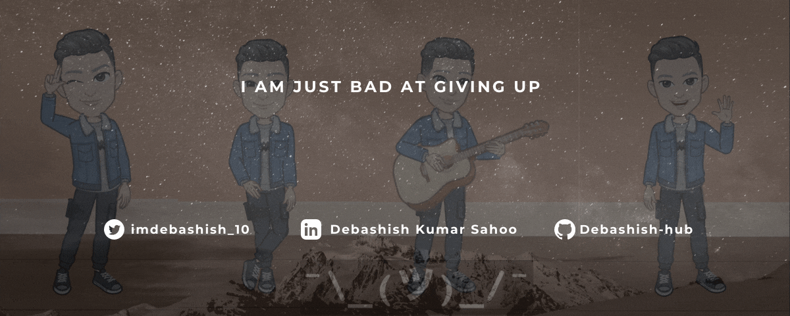

### Hi there!  I'm [Debashish!](https://github.com/Debashish-hub) 

 

Nice to see you here! I am Debashish Kumar Sahoo pursuing my Bachelor's degree in Computer Science & Engineering at College Of Engineering and Technology, Bhubaneswar, Odisha (Senior). I love to learn new technologies and applying them to real world solutions. Life is too short, so explore today as much as you can. I Love to listen Music 🎼, reading and writting blogs 📝

I am into Web Development 📝, Machine Learning 👨🏻‍💻, C++ 🍁, Python 🐍, Open Source 💪, Competitive Programming 🚀, Cyber Security 🔐, AWS 👑. Currently working as a DevOps Lead & Mentor at Learn For Cause 💻, Mentor at Lets Grow More Summer Of Code for Awesome Python Scripts and DSA Playyard Projects 🚩.

I would love to connect with you, so do not hesitate to connect with me on below handles🤝. Feel free to reach out to me if you are interested to talk or if you want to help me in anything or if you need any help from me, I am always open for a friendship 😃✔
 

  <b>  </b>
  
  
   
  
    
  
  
  
  

 

Contribution Graph

 

Trophies

 

 

 

 
   Visitor Count
  
   
  Show some ❤️ by starring some of the repositories!

